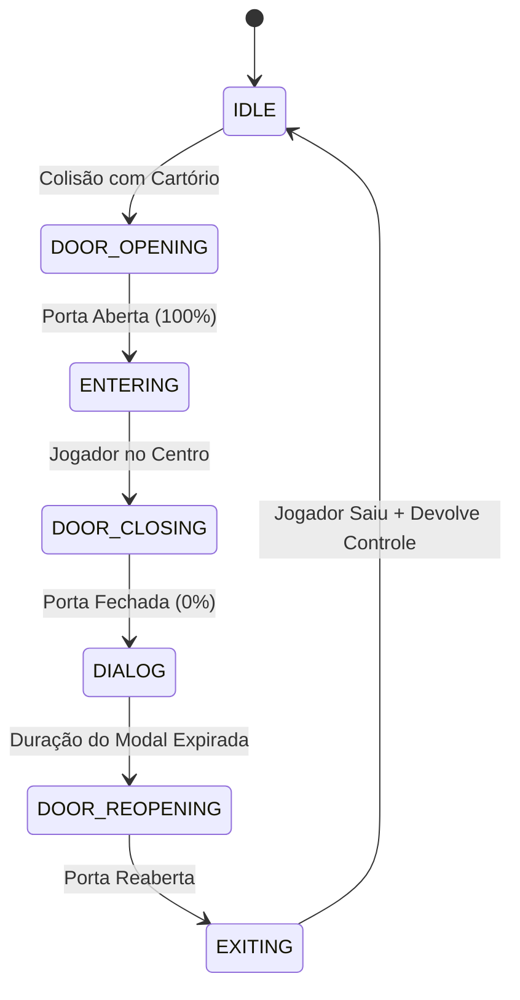

# 🎮 Guia de Execução & Arquitetura Técnica — Plataforma 2D

Documentação completa de execução, padrões de projeto, sistemas internos e soluções de engenharia adotadas no desenvolvimento do jogo.

---

## 🚀 1. Como Rodar o Projeto

### Pré-requisito
- **Node.js** instalado (versão 14 ou superior).

### Passo a Passo

1. **Abra o terminal** na pasta do projeto (`mini-steps`):

2. **Inicie o servidor local:**
   ```bash
   node server.js
   ```
   > O script `server.js` iniciará o servidor HTTP nativo com suporte a ES Modules, cabeçalhos MIME completos e streaming de vídeo MP4/GIF com suporte a *byte-range requests*.

3. **Acesse no seu navegador:**
   - **Jogo Standalone:** [http://localhost:3000](http://localhost:3000)
   - **Host Sandboxed (Página Embed):** [http://localhost:3000/embed.html](http://localhost:3000/embed.html)

---

## 🏗️ 2. Estrutura de Diretórios

```plaintext
mini-steps/
├── assets/                  # Mídias: papéis, GIFs/vídeos de checkpoint e morte, texturas
├── config/
│   ├── characterConfig.js   # Paleta de cores, dimensões e sprites do personagem
│   ├── gameMetrics.js       # Constantes físicas, dimensões de mundo, pontuação e câmera
│   └── messages.js          # Textos configuráveis de checkpoint, vitória e morte
├── css/
│   └── style.css            # Estilização responsiva, dvh, controles mobile, animações
├── entities/
│   ├── document.js          # Colecionáveis (certidões / papéis)
│   ├── flag.js              # Bandeiras de início e fim
│   └── player.js            # Física do jogador, animações procedurais e máquina de estados
├── systems/
│   ├── antiTamper.js        # Proteção contra manipulação de tempo, DevTools e score
│   ├── audio.js             # Sintetizador procedural via Web Audio API
│   ├── camera.js            # Câmera com interpolação suave (lerp) e zoom dinâmico
│   ├── checkpointSequence.js# Máquina de estados (FSM) da interação das casas
│   ├── collision.js         # Sistema AABB de colisão espacial
│   ├── dialogBox.js         # Renderizador universal de modal Canvas (Vídeo/GIF + Texto)
│   └── hud.js               # Interface de usuário (pontuação, etapas, efeitos)
├── world/
│   ├── generator.js         # Gerador procedural do cenário e plataformas
│   ├── house.js             # Estrutura das casas/cartórios com porta animada
│   ├── obstacle.js          # Rios, cactos, pedras e zonas de perigo
│   └── tree.js              # Árvores procedurais de fundo (parallax)
├── embed.html               # Página de hospedagem segura com iframe sandboxed
├── index.html               # Estrutura base do jogo
├── instructions.md          # Documentação técnica e guia
└── server.js                # Servidor HTTP com streaming e auto-detecção de MIME
```

---

## 🔬 3. Detalhes Técnicos & Decisões de Arquitetura

### 3.1. Renderizador Universal de Mídia no Canvas 2D (`DialogBox`)
- **Desafio:** Arquivos de animação frequentemente variam entre GIFs clássicos (palette-based) e MP4s compactados (H.264/AAC). Objetos `new Image()` do browser falham ao decodificar contêineres MP4, enquanto tags `<video>` comuns não são renderizadas no Canvas sem pipeline específico.
- **Solução:**
  - `dialogBox.js` implementa um **Universal Media Pipeline**. Ao pré-carregar qualquer ativo via `preloadMedia()`, o sistema inicializa tanto uma instância de `<video>` (com `autoplay`, `loop`, `muted`, `playsinline`) quanto uma de ``.
  - No ciclo de desenho (`render()`), o Canvas detecta a fonte ativa e desenha os quadros em tempo real a 60 FPS com `ctx.drawImage(mediaSource, ...)`.
  - Inclui preservação dinâmica de *aspect-ratio*, recorte com cantos arredondados (`ctx.roundRect` + `ctx.clip`) e moldura com *glow shader* pulsante sincronizado por senoide temporal.

### 3.2. Controles Touch com Multitoque Verdadeiro (`Pointer Events API`)
- **Problema clássico em jogos mobile:** O evento tradicional `pointerout` ou a perda de foco cancela ações quando o polegar desliza para fora do botão, e múltiplos toques simultâneos (ex: correr + pular) costumam sobrescrever o estado de input um do outro.
- **Solução:**
  - Cada botão (`btnLeft`, `btnRight`, `btnJump`) opera com um `Set<pointerId>` exclusivo.
  - No `pointerdown`, chamamos `btn.setPointerCapture(e.pointerId)`, garantindo que o navegador direcione todos os eventos daquele ponteiro ao botão de origem mesmo se o dedo deslizar por toda a tela.
  - O input da ação só é desligado quando o `Set` correspondente estiver completamente vazio (`size === 0`).
  - Aplicação de `touch-action: none` e `user-select: none` para erradicar gestos nativos do SO (zoom de duplo toque, rolagem e seleção de texto).

### 3.3. Viewport Moderno e Resiliência a Barras Dinâmicas
- **Unidades `dvh`:** Uso de `100dvh` (Dynamic Viewport Height) com fallback `100vh` para evitar que a barra de endereços retrátil do Chrome/Safari mobile empurre ou corte a interface.
- **Visual Viewport API:** O redimensionamento do Canvas em `resizeCanvas()` consulta prioritariamente `window.visualViewport.width` e `height`, ajustando a resolução nativa do buffer gráfico em perfeita harmonia com o layout físico do dispositivo.
- **Prevenção de Overscroll:** `overscroll-behavior: none` bloqueia o efeito "elástico" (pull-to-refresh) do navegador móvel.

### 3.4. Máquina de Estados Finita (FSM) dos Checkpoints
O fluxo de ativação dos cartórios é orquestrado como uma máquina de estados determinística em `checkpointSequence.js`:

- **Modal Único:** Durante o estado `DIALOG`, é exibido um modal unificado contendo a animação no topo e a mensagem temática do checkpoint logo abaixo, eliminando modais redundantes pós-saída.

### 3.5. Síntese Sonora Procedural (`Web Audio API`)
- O módulo `audio.js` sintetiza todos os efeitos de áudio (pulo, coleta de papéis, ativação de checkpoint, morte e vitória) diretamente através de osciladores (`OscillatorNode`) e curvas de ganho (`GainNode`), garantindo:
  - **Latência zero** em relação à física do jogo.
  - **Zero requisições HTTP adicionais** para carregamento de áudios.
  - Suporte completo ao desbloqueio da política de *Autoplay* do navegador no primeiro toque/clique do usuário.

### 3.6. Camada de Segurança e Anti-Tamper
- **Timing Validation:** O `antiTamper.js` valida desvios anormais de Delta Time (`dt`) contra o relógio de alta precisão (`performance.now()`), mitigando tentativas de *speed hack*.
- **Score Integrity:** As pontuações acumuladas são validadas contra a curva matemática teórica permitida antes de oficializar a vitória na bandeira final.
- **Sandboxing:** A página `embed.html` encapsula o jogo via `<iframe sandbox="allow-scripts">`, isolando o escopo do jogo e prevenindo injeções ou acessos indevidos à janela hospedeira.

---

## 🎯 4. Boas Práticas para Expansão do Jogo

1. **Novos Tipos de Mídia:**
   - Adicione novos arquivos em `assets/` e registre-os em `game.js` com `dialogBox.preloadImage('chave', 'assets/arquivo.ext')`. O sistema cuidará automaticamente se for GIF, MP4, PNG ou JPG.
2. **Novas Mensagens:**
   - Edite diretamente `config/messages.js`. A lógica de Word Wrap do modal recalcula automaticamente as quebras de linha e o espaçamento vertical.
3. **Ajustes de Física e Dificuldade:**
   - Ajuste `PHYSICS.GRAVITY`, `PLAYER.SPEED`, `PLAYER.JUMP_FORCE` ou `WORLD.DISTRIBUTION` em `config/gameMetrics.js`.
